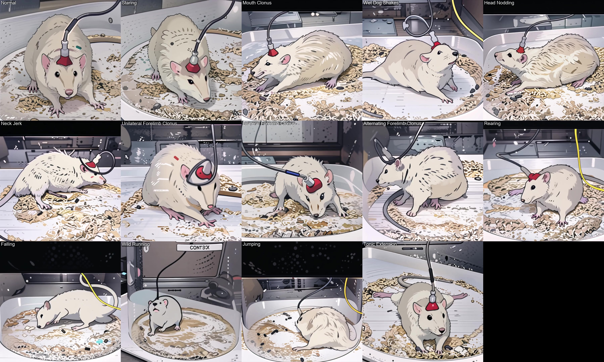

# RatSeizure: A Benchmark and Saliency-Context Transformer for Rat Seizure Localization

This repository is the official implementation of our paper [RatSeizure: A Benchmark and Saliency-Context Transformer for Rat Seizure Localization](https://arxiv.org/abs/2603.26780).

Official repository for RatSeizure, a benchmark dataset and baseline model for temporal seizure behavior localization in rats.

_________________
## Notice

<p style="font-size: 1.15em;"><strong>All animal use complied with guidelines from the National Institutes of Health (NIH) and the Albany Medical College (AMC) Institutional Animal Care and Use Committee (IACUC).</strong></p>

Protocol Review: All projects involving vertebrate animals have been reviewed and approved by the IACUC before any animal work begins, ensuring compliance with ethical standards and appropriate scientific justification for species and numbers used.

<!-- This repository contains data from rat seizure experiments, which some may find disturbing. Viewer discretion is advised.

All animal use complied with guidelines from the National Institutes of Health (NIH) and the Albany Medical College (AMC) Institutional Animal Care and Use Committee (IACUC). -->

________________
## Demo Snapshots

Below are static screenshots from `assets/AI_ratseizure_demo.mp4`.
<p><em>Note: The cable is for neural-signaling.</em></p>
<p align="center">
  
</p>

________________
## Action Unit Labels
The RatSeizure dataset defines 14 seizure-related behavioral Action Units (AUs).

| Label | AU                          | Description                                  |
| ----- | --------------------------- | -------------------------------------------- |
|   0   | Normal                      | No seizure observed                          |
|   1   | Staring                     | Behavioral arrest without movement           |
|   2   | Mouth Clonus                | Mouth and jaw twitching                      |
|   3   | Wet-Dog Shake               | Whole body shaking                           |
|   4   | Head Nodding                | Repeated up/down "yes" head motion           |
|   5   | Neck Jerk                   | Repeated, intense or rapid "yes" head motion |
|   6   | Unilateral Forelimb Clonus  | Repetitive forelimb movement on one side     |
|   7   | Bilateral Forelimb Clonus   | Repetitive movement of both forelimbs        |
|   8   | Alternating Forelimb Clonus | Alternating forelimb movements               |
|   9   | Rearing                     | Standing upright on hind limbs               |
|   10  | Falling                     | Loss of posture with uncontrolled fall       |
|   11  | Wild Running                | Rapid uncontrolled circular running          |
|   12  | Jumping                     | Sudden upward jump                           |
|   13  | Tonic Extension             | Limbs rigidly extended while lying           |

________________
## Dataset Availability

To support reproducible research, RatSeizure annotations, train/validation/test splits, extracted video features, and evaluation scripts are publicly available.

Due to animal-study ethics, institutional requirements, and data-governance restrictions, access to raw experimental videos requires completion of a Data Use Agreement (DUA).

Public resources:
- Annotations
- Train/Test splits
- Extracted video features
- Evaluation scripts
- Baseline implementations

Restricted resources:
- Raw experimental videos (available upon approved request)

To request access to the RatSeizure dataset videos, please complete the dataset request form: [Google Form link](https://forms.gle/64cwAcxg1NmTDnmLA)

________________
## License and Data Use

The **RatSeizure Dataset** is released by the **CVML Lab, University at Albany, SUNY, and Albany Medical College (AMC)** for **research and educational use only**.

Please review the following repository documents before downloading, accessing, or using the dataset:

- **`LICENSE`**: RatSeizure dataset license terms
- **`Data Use Agreement.md`**: RatSeizure data use agreement and user obligations

By downloading, accessing, or using this dataset, you agree to the terms described in both **`LICENSE`** and **`Data Use Agreement.md`**.

### Access Policy

Only users who have signed the **Data Use Agreement (DUA)** are permitted to access the dataset files.

### Summary of Use Conditions

- You may use the dataset only for lawful research, educational, and scholarly purposes.
- You may not use the dataset for any unlawful, harmful, deceptive, or misleading purpose.
- You may not redistribute, sublicense, resell, publish, or otherwise share the dataset, in whole or in part, without prior written permission from the dataset maintainers.
- You must exercise reasonable care to protect the physical and electronic security of the dataset and prevent unauthorized access or misuse.
- If you discover any content in the dataset, metadata, annotations, or related documentation that appears sensitive, confidential, or improperly included, you must promptly report it to **uacvmllab@gmail.com** and identify the relevant location of the issue.
- Any paper, thesis, report, preprint, presentation, benchmark submission, model release, or software release arising from use of the dataset must appropriately cite the RatSeizure dataset and associated publication(s).
- Users are strongly encouraged to release code, evaluation scripts, and related reproducibility materials associated with published results whenever permitted by institutional, legal, and collaborative constraints.
- The dataset is provided for research, educational, and related scholarly purposes only and is **not** intended for clinical diagnosis, treatment, medical decision-making, or veterinary decision-making.

### No Warranty

The RatSeizure Dataset is provided **“as is”**, without warranty of any kind, express or implied, including but not limited to the warranties of merchantability, fitness for a particular purpose, title, and noninfringement. In no event shall the authors, copyright holders, dataset maintainers, or the **CVML Lab, University at Albany, SUNY, and Albany Medical College (AMC)** be liable for any claim, damages, or other liability arising from, out of, or in connection with the dataset or its use.

### Contact

**CVML Lab, University at Albany, SUNY (Email: uacvmllab@gmail.com)**  
**Albany Medical College (AMC)**  

________________
## Citation
Please kindly consider citing our papers in your publications. 
```
@article{Tsai2026RatSeizure,
  title   = {{RatSeizure: A Benchmark and Saliency-Context Transformer for Rat Seizure Localization}}, 
  author  = {Ting Yu Tsai and An Yu and Lucy Lee and Felix X.-F. Ye and Damian S. Shin and Tzu-Jen Kao and Xin Li and Ming-Ching Chang},
  year    = {2026},
  journal = {arXiv preprint arXiv:2603.26780},
  url     = {https://arxiv.org/abs/2603.26780}
}
```
